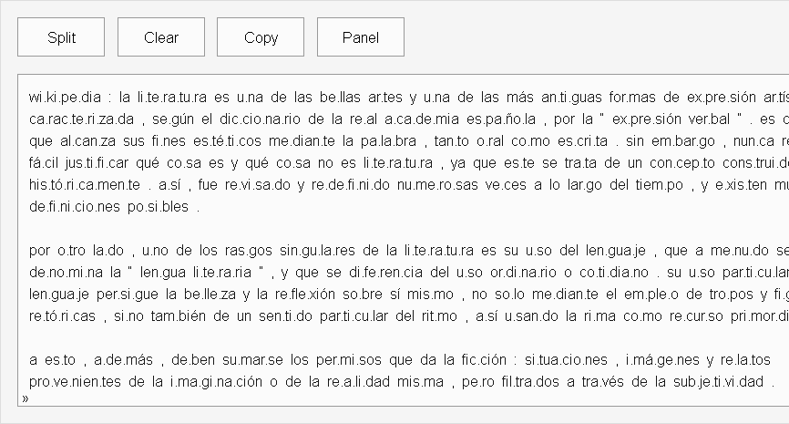
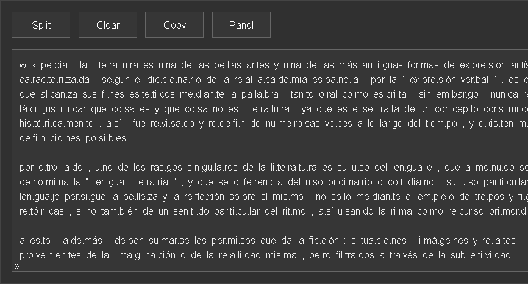

# PRUEBA UNO

Una prueba para ver cómo muestra github README espacios,etc.

## IMAGENES

## IMAGENES

## IMAGENES

## IMAGENES

## IMAGENES

## REGLAS

1. Las letras a y b.
2. Las palabras a y c.
3. Las vocales a y e.
4. Las consonantes s y g.

Esto es una prueba de espacio

Otra prueba de espacio

Otro ítem para ver la altura

Último ítem para ver la altura

- Las letras a y b.
- Las palabras a y c.
- Las vocales a y e.
- Las consonantes s y g.

Combinaciones de lista

- 1. La letra e y f son buenas
- 2. La letra g es suave
- 3. La consonante x es flexible
- 4. La combinación gt no se ve

Otro salto de línea

Último salto de linea : ( [Enlace](https://github.com) )

## REGLAS

&#8226; 1. Las letras se separan

&#8226; 2. Las letras se separan

&#8226; 3. Las letras se separan

&#8226; 4. Las letras se separan

### Otro salto de línea para ver espacio

